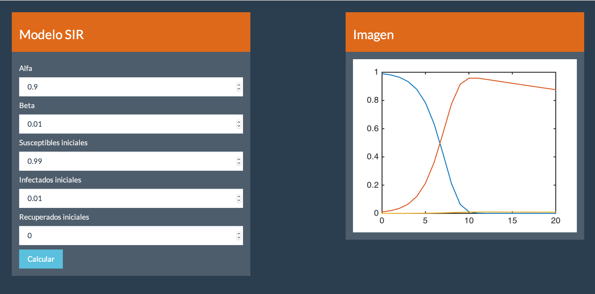
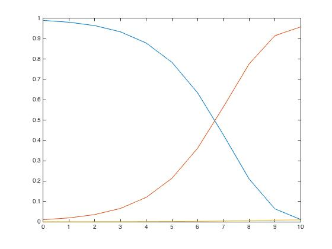

Apps Interactivas en Matlab 1
================
Rodrigo Zepeda-Tello

Introducción
------------

Varios programas como [R](https://shiny.rstudio.com/gallery/), [Python](http://bokeh.pydata.org/en/latest/) y [Mathematica](http://demonstrations.wolfram.com/) (entre otros) permiten al usuario generar interfaces gráficas interactivas (GUI) que cualquiera con una conexión a Internet (y sin necesariamente tener el programa) puede usar. Todos estos desarrollos están enmarcados dentro del proceso de construcción de [documentos dirigidos por datos](https://d3js.org/).

[Matlab](https://www.mathworks.com/products/matlab.html) no es la excepción y una serie de [blogs](http://blogs.mathworks.com/community/2008/02/25/interactive-web-pages-in-matlab-part-3/) en Mathworks han intentado explicar cómo conectarlo con una interfaz Imagen desarrollada en [HTML](https://en.wikipedia.org/wiki/HTML). El problema, para una principiante, es que dichos blogs asumen conocimiento de HTML y [Javascript](https://www.javascript.com/). Así mismo, los ejemplos mencionados en dicha serie de blogs son estéticamente poco agradables. Matlab posee información más avanzada para crear aplicaciones pero para ello se utilizan [paquetes extra](https://www.mathworks.com/solutions/desktop-web-deployment.html) de Matlab que no son gratuitos (y parecen de [Windows 95](https://en.wikipedia.org/wiki/Windows_95)).

Este tutorial busca mostrar cómo generar aplicaciones HTML en Matlab similares a las aplicaciones [Shiny de R](https://shiny.rstudio.com/gallery/) que permitan una interfaz gráfica aceptable. La ventaja adicional de aprender a desarrollar aplicaciones con HTML/Javascript radica en que éstas pueden tener distintos programas de trasforndo: una misma interfaz gráfica puede desarrollarse para código de Matlab, R, [Java](https://www.java.com/en/), [Julia](http://julialang.org/) o [C++](https://isocpp.org/).

La interfaz Imagen que vamos a generar en este tutorial es la siguiente:

Y para hacerlo necesitamos una función de [Matlab](#modelo-en-matlab) así como conocimiento básico de [HTML](#html), [CSS](#css) y [Javascript](#javascript). ¡Iniciemos!

Modelo en Matlab
----------------

Vamos a considerar el modelo de una enfermedad donde dividimos a la población en Susceptibles (*S*), Infectados (*I*) y Recuperados (*R*). Los Susceptibles se convierten en Infectados a una tasa *α* y los Infectados sanan a una tasa *β* convirtiéndose en Recuperados. La relación de recurrencia propuesta para modelar este proceso es:
\begin{equation}
\begin{aligned}
S_n & = S_{n-1} - \alpha S_{n-1} I_{n-1}, \\
I_n & = I_{n-1} + \alpha S_{n-1} I_{n-1} - \beta I_{n-1}, \\
R_n & = \beta I_{n-1}.
\end{aligned}
\end{equation}
donde *S**n*, *I**n*, *R**n* denotan el número de susceptibles, infectados y removidos al tiempo *n*. Podemos codificar en Matlab dicho proceso como una función:

    function [] = modelosir(alpha, beta, s0, i0, r0)
    %Modelo SIR que cuantifica la cantidad de susceptibles,
    %infectados y recuperados en una epidemia.
    %Para ello sigue las relaciones de recurrencia:
    %S_n  = S_{n-1} - alpha S_{n-1} I_{n-1},
    %I_n & = I_{n-1} + alpha S_{n-1} I_{n-1} - beta I_{n-1},
    %R_n & = beta I_{n-1}.
    %
    %INPUT:
    %alpha .- Tasa de infección.
    %beta  .- Tasa de recuperación.
    %s0    .- Número inicial de susceptibles
    %i0    .- Número inicial de infectados
    %r0    .- Número inicial de recuperados
    %
    %OUTPUT:
    %s     .- Vector con número de susceptibles desde s_0 hasta s_n
    %i     .- Vector con número de infectados desde i_0 hasta i_n
    %r     .- Vector con número de recuperados desde r_0 hasta r_n
    %

    %Número de días a estimar
    n = 20;

    %Inicializamos los vectores
    s = zeros(n + 1, 1);
    i = zeros(n + 1, 1);
    r = zeros(n + 1, 1);

    %Ponemos los valores iniciales
    s(1) = s0;
    i(1) = i0;
    r(1) = r0;

    %Creamos un for que calcule la cantidad de individuos
    for j = 2:(n+1)
        s(j) = s(j-1) - alpha*s(j-1)*i(j-1);
        i(j) = i(j-1) + alpha*s(j-1)*i(j-1) - beta*i(j-1);
        r(j) = beta*i(j-1);
    end

    %Graficamos
    plot(0:n, [s, i, r])

    end

Y lo podemos correr, por ejemplo:

    modelosir(0.9, 0.01, 0.99, 0.01, 0);

y tener la siguiente Imagen:

Esto está muy bonito para alguien que está familiarizado con correr funciones desde una ventana de comandos (como la de Matlab). ¿Pero qué pasa si un médico sin conocimiento de matemáticas ni programación desea saber cómo evolucionará una enfermedad? Una opción es que le hable a su matemático de cabecera y le pida vuelva a correr Matlab con diferentes valores de *α* y *β* según la investigación proponga. Una mejor opción es dejar una interfaz Imagen que permita cambiar los valores de *α* y *β* dinámicamente. Para ello utilizaremos HTML.

HTML
----

HTML (HyperText Markup Language) es el alma de las páginas de Internet y si has entrado a Internet alguna vez, sabes que las páginas pueden hacer magia y tienen una apariencia genial. HTML en sí tiene una apariencia mala pero un programa conocido como css ayuda a que se vean geniales las páginas. Comencemos con HTML. (Por cierto que si te interesa más de HTML puedes tomar [los cursos gratuitos de code academy](https://www.codecademy.com)).

Todo programa de HTML contiene una cabeza `<head>` y un cuerpo `<body>`. En la cabeza van propiedades de la página que no aparecerán en la página (por ejemplo si tu documento llama funciones). El cuerpo es la parte del HTML que "se ve" en el buscador. La página más básica de HTML está dada por:

    <!DOCTYPE html>
    <html>

      <head>
        <title>Titulo de pagina asombrosa</title>
      </head>
      
      <body>
      Modelo SIR
      </body>
      
    </html>

Los comandos que aparecen anteriormente \*\*siempre hay que ponerlos\*. El `<!DOCTYPE html>` especifica que trabajaremos en HTML5 (el más nuevo). La etiqueta `<html>` indica que a partir de ahí y hasta `</html>` estará nuestra página. Nota que todas las etiquetas tienen un inicio con su nombre (`<head>`, `<title>`, `<body>`) y un final que indican dónde termina usando "backslash" (`</head>`, `</title>`, `</body>`). ¡Es bien importante que no los olvides nunca!

Los objetos más importantes de un HTML son los `
`. Podemos imaginar una página como un conjunto de partes separadas donde cada parte es un `
`. Por ejemplo:

No hay ninguna regla para hacer `
`s, se aprende experimentando. Hagamos uno para ver cómo se ve.

    <!DOCTYPE html>
    <html>

      <head>
        <title>Titulo de pagina asombrosa</title>
      </head>
      
      <body>
      
Modelo SIR

      </body>
      
    </html>

¡No se ve nada! Esto es porque nuestro `
` tiene fondo blanco. ¡Cambiemos el color para verlo!

    <!DOCTYPE html>
    <html>

      <head>
        <title>Titulo de pagina asombrosa</title>
      </head>
      
      <body>
      
Modelo SIR

      </body>
      
    </html>

También se puede cambiar el tamaño:

    <html>

      <head>
        <title>Titulo de pagina asombrosa</title>
      </head>
      
      <body>
          

              Modelo SIR
          

      </body>
      
    </html>

Podemos poner un `
` al lado de otro transformándolos en `float`:

    <html>

      <head>
        <title>Titulo de pagina asombrosa</title>
      </head>
      
      <body>
          

             Modelo SIR
          

          

             Imagen
          

      </body>
      
    </html>

Y podemos hacer que no se vean tan pegados agregando un margen:

    <html>

      <head>
        <title>Titulo de pagina asombrosa</title>
      </head>
      
      <body>
          

             Modelo SIR
          

          

             Imagen
          

      </body>
      
    </html>

Le falta mucho a la página para verse bonita pero por suerte la gente que hace `css` ya tiene formatos predeterminados. ¡Usemos uno!

CSS
---

CSS (o Cascading Style Sheet) son formatos "predeterminados" para páginas de Internet. Esto permite automáticamente hacer formatos más bonitos. Para ello puedes descargar los formatos (de nombre `bootstrap.css` o `bootstrap.min.css`) de Internet. Yo utilizaré el [Superhero de Bootswatch](https://bootswatch.com/) para este tutorial pero tú puedes descargar otro. Para nuestros propósitos `bootstrap.min.css` es suficiente (contiene menos cosas que `bootstrap.css` pero no estamos haciendo algo muy avanzado como para echarlo en falta). Descarga el bootstrap que más te guste y ponlo en la misma carpeta que tu archivo HTML. Para poder usar el CSS es necesario decirle al código HTML que lo use; para ello agregamos una línea en el `<head>`:

    <html>

      <head>
        <title>Titulo de pagina asombrosa</title>
        <link rel="stylesheet" type="text/css" href="bootstrap.min.css"/>
      </head>
      
      <body>
          

             Modelo SIR
          

          

             Imagen
          

      </body>
      
    </html>

Nota cómo, de inmediato, cambia el color de fondo y el formato de letra. Bootstrap viene equipado con objetos que se llaman páneles. Cambiemos nuestros `
`s por páneles usando `class`:

    <html>

      <head>
        <title>Titulo de pagina asombrosa</title>
        <link rel="stylesheet" type="text/css" href="bootstrap.min.css"/>
      </head>
      
      <body>
          

            Modelo SIR
          

          

            Imagen
          

      </body>
      
    </html>

Nota cómo cambia el formato a algo más serio. Cada panel tiene encabezado y cuerpo. Agreguemos los encabezados:

    <html>

      <head>
        <title>Titulo de pagina asombrosa</title>
        <link rel="stylesheet" type="text/css" href="bootstrap.min.css"/>
      </head>
      
      <body>
          

             

                <h3>Modelo SIR</h3>
             

          

          

             

                <h3>Imagen</h3>
             

          

      </body>
      
    </html>

Y luego los cuerpos:

    <html>

      <head>
        <title>Titulo de pagina asombrosa</title>
        <link rel="stylesheet" type="text/css" href="bootstrap.min.css"/>
      </head>
      
      <body>
          

             

                <h3>Modelo SIR</h3>
             

             

             CUERPO
             

          

          

             

                <h3>Imagen</h3>
             

             

             CUERPO 2
             

          

      </body>
      
    </html>

Por último agreguemos espacios de `input` para que la gente que use nuestro programa agregue los valores de *α*, *β*, *S*0, *I*0, *R*0. Para ello usamos la etiqueta `<input>` que entre sus opciones contiene el tipo de input (`type`), la clase del bootstap (para que se vea bonita), un `id` que indica cómo se va a llamar la variable (para cuando la usemos para cálculos) y el valor predeterminado que queremos contenga.

    <!DOCTYPE html>
    <html>

      <head>
        <title>Titulo de pagina asombrosa</title>
        <link rel="stylesheet" type="text/css" href="bootstrap.min.css"/>
      </head>
      
      <body>
            

                

                    <h3>Modelo SIR</h3>
                

                

                    <h5> Alfa </h5>
                    <input type="number" class="form-control" id="alpha" 
                           value = "0.9">
                    <h5> Beta </h5>
                    <input type="number" class="form-control" id="beta" 
                           value = "0.01">
                    <h5> Susceptibles iniciales </h5>
                    <input type="number" class="form-control" id="s0" 
                           value = "0.99">
                    <h5> Infectados iniciales </h5>
                    <input type="number" class="form-control" id="i0" 
                           value = "0.01">
                    <h5> Recuperados iniciales </h5>
                    <input type="number" class="form-control" id="r0" 
                           value = "0">
                

            

            

                

                    <h3>Imagen</h3>
                

                

                    CUERPO 2
                

            

          
      </body>
      
    </html>

Lo único que nos falta es enviar estos valores de input a Matlab y después traer la Imagen generada por Matlab a nuestra interfaz Imagen. Para ello necesitaremos Javascript.

Javascript
----------

Javascript es un programa que nada tiene que ver con Java (excepto por el nombre). Éste es el motor detrás del funcionamiento de las páginas de Internet (como habrás visto HTML no hace más que poner cosas). Para escribir Javascript es necesario agregar una nueva etiqueta al HTML: `
      </head>
      
      <body>
            

                

                    <h3>Modelo SIR</h3>
                

                

                    <h5> Alfa </h5>
                    <input type="number" class="form-control" id="alpha" 
                           value = "0.9">
                    <h5> Beta </h5>
                    <input type="number" class="form-control" id="beta" 
                           value = "0.01">
                    <h5> Susceptibles iniciales </h5>
                    <input type="number" class="form-control" id="s0" 
                           value = "0.99">
                    <h5> Infectados iniciales </h5>
                    <input type="number" class="form-control" id="i0" 
                           value = "0.01">
                    <h5> Recuperados iniciales </h5>
                    <input type="number" class="form-control" id="r0" 
                           value = "0">
                

            

            

                

                    <h3>Imagen</h3>
                

                

                    CUERPO 2
                

            

          
      </body>
      
    </html>

**AGUAS: Nota que Jquery lo estamos vinculando con una página de Internet por lo que si no hay Internet no podremos usarlo. Una forma de evitar este problema es descargando Jquery de Internet y vinculándolo como archivo local.**

Ahora sí: el momento de la verdad. ¡Corramos la función `sin` de Matlab desde HTML usando un `
        
      </head>
      
      <body>
            

                

                    <h3>Modelo SIR</h3>
                

                

                    <h5> Alfa </h5>
                    <input type="number" class="form-control" id="alpha" 
                           value = "0.9">
                    <h5> Beta </h5>
                    <input type="number" class="form-control" id="beta" 
                           value = "0.01">
                    <h5> Susceptibles iniciales </h5>
                    <input type="number" class="form-control" id="s0" 
                           value = "0.99">
                    <h5> Infectados iniciales </h5>
                    <input type="number" class="form-control" id="i0" 
                           value = "0.01">
                    <h5> Recuperados iniciales </h5>
                    <input type="number" class="form-control" id="r0" 
                           value = "0">
                

            

            

                

                    <h3>Imagen</h3>
                

                

                    CUERPO 2
                

            

          
      </body>
      
    </html>

En el código anterior, `$( document ).ready(function() {` indica que lo que está dentro de la llave debe de correrse en cuanto esté listo el documento (la página de internet). El `document.location = "matlab:sin(2)";` establece que se debe correr la función seno de Matlab.

**Nota: Para que esto funcione debes abrir el documento HTML desde Matlab. Abrirlo desde otro buscador (e.g. Chrome o Mozilla) no servirá pues el otro buscador no sabe que Matlab existe. Para que Chrome o Mozilla sepan que Matlab existe hay que pagar... (por cosas como esta no me gusta Matlab).**

También podemos correr la función `modelosir` con valores predeterminados cambiando el `document.location`:

    <!DOCTYPE html>
    <html>

      <head>
        <title>Titulo de pagina asombrosa</title>
        <link rel="stylesheet" type="text/css" href="bootstrap.min.css"/>
        
        
      </head>
      
      <body>
            

                

                    <h3>Modelo SIR</h3>
                

                

                    <h5> Alfa </h5>
                    <input type="number" class="form-control" id="alpha" 
                           value = "0.9">
                    <h5> Beta </h5>
                    <input type="number" class="form-control" id="beta" 
                           value = "0.01">
                    <h5> Susceptibles iniciales </h5>
                    <input type="number" class="form-control" id="s0" 
                           value = "0.99">
                    <h5> Infectados iniciales </h5>
                    <input type="number" class="form-control" id="i0" 
                           value = "0.01">
                    <h5> Recuperados iniciales </h5>
                    <input type="number" class="form-control" id="r0" 
                           value = "0">
                

            

            

                

                    <h3>Imagen</h3>
                

                

                    CUERPO 2
                

            

          
      </body>
      
    </html>

Podemos agregar un botón con `<a>` que tenga `id` boton de tal forma que la página calcule `modelosir` sólo hasta después de que dimos click en el botón. Para ello agregamos el botón:

    <!DOCTYPE html>
    <html>

      <head>
        <title>Titulo de pagina asombrosa</title>
        <link rel="stylesheet" type="text/css" href="bootstrap.min.css"/>
        
        
      </head>
      
      <body>
            

                

                    <h3>Modelo SIR</h3>
                

                

                    <h5> Alfa </h5>
                    <input type="number" class="form-control" id="alpha" 
                           value = "0.9">
                    <h5> Beta </h5>
                    <input type="number" class="form-control" id="beta" 
                           value = "0.01">
                    <h5> Susceptibles iniciales </h5>
                    <input type="number" class="form-control" id="s0" 
                           value = "0.99">
                    <h5> Infectados iniciales </h5>
                    <input type="number" class="form-control" id="i0" 
                           value = "0.01">
                    <h5> Recuperados iniciales </h5>
                    <input type="number" class="form-control" id="r0" 
                           value = "0">
                    <a href="#" class="btn btn-info" style = "margin-top: 2%;" id ="boton">
                        Calcular</a>       
                

            

            

                

                    <h3>Imagen</h3>
                

                

                    CUERPO 2
                

            

          
      </body>
      
    </html>

Y usamos la función `.click` para asegurarnos que corra Marlab sólo al hacer click en el boton:

    <!DOCTYPE html>
    <html>

      <head>
        <title>Titulo de pagina asombrosa</title>
        <link rel="stylesheet" type="text/css" href="bootstrap.min.css"/>
        
        
      </head>
      
      <body>
            

                

                    <h3>Modelo SIR</h3>
                

                

                    <h5> Alfa </h5>
                    <input type="number" class="form-control" id="alpha" 
                           value = "0.9">
                    <h5> Beta </h5>
                    <input type="number" class="form-control" id="beta" 
                           value = "0.01">
                    <h5> Susceptibles iniciales </h5>
                    <input type="number" class="form-control" id="s0" 
                           value = "0.99">
                    <h5> Infectados iniciales </h5>
                    <input type="number" class="form-control" id="i0" 
                           value = "0.01">
                    <h5> Recuperados iniciales </h5>
                    <input type="number" class="form-control" id="r0" 
                           value = "0">
                    <a href="#" class="btn btn-info" style = "margin-top: 2%;" id ="boton">
                        Calcular</a>       
                

            

            

                

                    <h3>Imagen</h3>
                

                

                    CUERPO 2
                

            

          
      </body>
      
    </html>

Por último, necesitamos leer en `modelosir` los valores cambiados en la interfaz gráfica. Para ello el comando `$("#mi_id").val();` retorna el valor inputado en el objeto con `id` dada por `mi_id` (recuerda que cuando creamos los `<input>` les pusimos `id`).

    <!DOCTYPE html>
    <html>

      <head>
        <title>Titulo de pagina asombrosa</title>
        <link rel="stylesheet" type="text/css" href="bootstrap.min.css"/>
        
        
      </head>
      
      <body>
            

                

                    <h3>Modelo SIR</h3>
                

                

                    <h5> Alfa </h5>
                    <input type="number" class="form-control" id="alpha" 
                           value = "0.9">
                    <h5> Beta </h5>
                    <input type="number" class="form-control" id="beta" 
                           value = "0.01">
                    <h5> Susceptibles iniciales </h5>
                    <input type="number" class="form-control" id="s0" 
                           value = "0.99">
                    <h5> Infectados iniciales </h5>
                    <input type="number" class="form-control" id="i0" 
                           value = "0.01">
                    <h5> Recuperados iniciales </h5>
                    <input type="number" class="form-control" id="r0" 
                           value = "0">
                    <a href="#" class="btn btn-info" style = "margin-top: 2%;" id ="boton">
                        Calcular</a>
                

            

            

                

                    <h3>Imagen</h3>
                

                

                    CUERPO 2
                

            

          
      </body>
      
    </html>

El comando `"matlab:modelosir(" + valor_alpha + "," + valor_beta + "," + valor_s0 + "," + valor_i0 + "," + valor_r0 + ")";` concatena el código y lo pasa a Matlab. ¡Observa cómo cambia la gráfica dada por Matlab cuando cambias los inputs!

El último paso es agregar la imagen a nuestra interfaz gráfica. Para ello hacemos que nuestra función de Matlab además de generar la figura la guarde:

    function [] = modelosir(alpha, beta, s0, i0, r0)
    %Modelo SIR que cuantifica la cantidad de susceptibles,
    %infectados y recuperados en una epidemia.
    %Para ello sigue las relaciones de recurrencia:
    %S_n  = S_{n-1} - alpha S_{n-1} I_{n-1},
    %I_n & = I_{n-1} + alpha S_{n-1} I_{n-1} - beta I_{n-1},
    %R_n & = beta I_{n-1}.
    %
    %INPUT:
    %alpha .- Tasa de infección.
    %beta  .- Tasa de recuperación.
    %s0    .- Número inicial de susceptibles
    %i0    .- Número inicial de infectados
    %r0    .- Número inicial de recuperados
    %
    %OUTPUT:
    %s     .- Vector con número de susceptibles desde s_0 hasta s_n
    %i     .- Vector con número de infectados desde i_0 hasta i_n
    %r     .- Vector con número de recuperados desde r_0 hasta r_n
    %

    %Número de días a estimar
    n = 20;

    %Inicializamos los vectores
    s = zeros(n + 1, 1);
    i = zeros(n + 1, 1);
    r = zeros(n + 1, 1);

    %Ponemos los valores iniciales
    s(1) = s0;
    i(1) = i0;
    r(1) = r0;

    %Creamos un for que calcule la cantidad de individuos
    for j = 2:(n+1)
        s(j) = s(j-1) - alpha*s(j-1)*i(j-1);
        i(j) = i(j-1) + alpha*s(j-1)*i(j-1) - beta*i(j-1);
        r(j) = beta*i(j-1);
    end

    %Graficamos
    plot(0:n, [s, i, r])
    print('modelo.png','-dpng');
    end

Por último, agregamos un espacio para la figura en el HTML usando un ``:

    <!DOCTYPE html>
    <html>

      <head>
        <title>Titulo de pagina asombrosa</title>
        <link rel="stylesheet" type="text/css" href="bootstrap.min.css"/>
        
        
      </head>
      
      <body>
            

                

                    <h3>Modelo SIR</h3>
                

                

                    <h5> Alfa </h5>
                    <input type="number" class="form-control" id="alpha" 
                           value = "0.9">
                    <h5> Beta </h5>
                    <input type="number" class="form-control" id="beta" 
                           value = "0.01">
                    <h5> Susceptibles iniciales </h5>
                    <input type="number" class="form-control" id="s0" 
                           value = "0.99">
                    <h5> Infectados iniciales </h5>
                    <input type="number" class="form-control" id="i0" 
                           value = "0.01">
                    <h5> Recuperados iniciales </h5>
                    <input type="number" class="form-control" id="r0" 
                           value = "0">
                    <a href="#" class="btn btn-info" style = "margin-top: 2%;" id ="boton">
                        Calcular</a>
                

            

            

                

                    <h3>Imagen</h3>
                

                

                    
                

            

          
      </body>
      
    </html>

Por último, agregamos a Javascript el código que introduce la imagen en el `` de nombre `contiene_imagen`.

    <!DOCTYPE html>
    <html>

      <head>
        <title>Titulo de pagina asombrosa</title>
        <link rel="stylesheet" type="text/css" href="bootstrap.min.css"/>
        
        
      </head>
      
      <body>
            

                

                    <h3>Modelo SIR</h3>
                

                

                    <h5> Alfa </h5>
                    <input type="number" class="form-control" id="alpha" 
                           value = "0.9">
                    <h5> Beta </h5>
                    <input type="number" class="form-control" id="beta" 
                           value = "0.01">
                    <h5> Susceptibles iniciales </h5>
                    <input type="number" class="form-control" id="s0" 
                           value = "0.99">
                    <h5> Infectados iniciales </h5>
                    <input type="number" class="form-control" id="i0" 
                           value = "0.01">
                    <h5> Recuperados iniciales </h5>
                    <input type="number" class="form-control" id="r0" 
                           value = "0">
                    <a href="#" class="btn btn-info" style = "margin-top: 2%;" id ="boton">
                        Calcular</a>
                

            

            

                

                    <h3>Imagen</h3>
                

                

                    
                

            

          
      </body>
      
    </html>

En el código anterior `setTimeout` le dice a Javascript que espere `500` milisegundos antes de intentar poner la imagen (mientras Matlab la genera) y luego busca la imagen mediante `document.getElementById('contiene_imagen').src='modelo.png';`. ¡Hemos terminado nuestra App!

Por supuesto que la gráfica puede mejorarse y para eso está [`Plotly` pero esa es otra historia...](https://plot.ly/matlab/)
